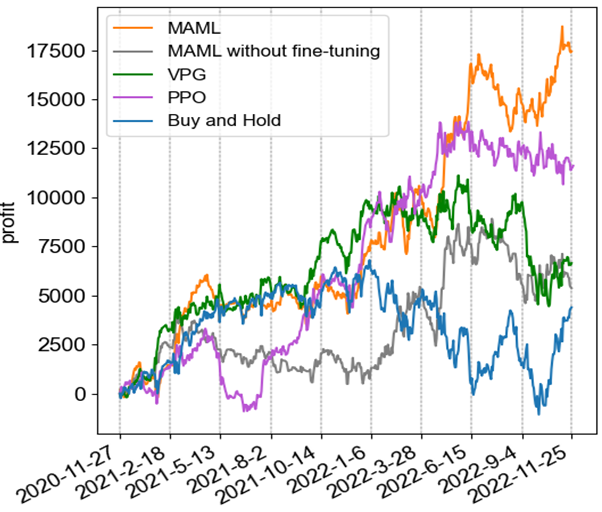

# MAML-Trading

A trading strategy framework based on Model-Agnostic Meta-Learning (MAML) and Proximal Policy Optimization (PPO), designed to quickly adapt to dynamic market environments.

## Overview

This project combines MAML (Model-Agnostic Meta-Learning) with PPO (Proximal Policy Optimization) to build a trading model that can rapidly adapt to new market data. By learning an optimal initial parameter configuration through meta-training, the model can achieve strong performance in new market scenarios with minimal gradient updates—making it well-suited for the ever-changing nature of financial markets.

## Project Structure

```
maml_trading/
├── main_ppo.py        # Main training script
├── ppo_trade.py       # Testing and trading evaluation script
├── metalearner_ppo.py # Core meta-learner implementation
├── policies/          # Policy network definitions
├── baseline.py        # Baseline value function implementations
├── sampler.py         # Data sampling and trajectory generation
├── episode.py         # Data structure for storing episode trajectories
├── envs/              # Trading environment definitions
│   ├── trading_env.py      # Main trading environment
│   └── test_trading_env.py # Testing environment
└── preprocessing/     # Tools for data preprocessing
```

## Usage

### Training

Run the training process with `main_ppo.py` (the core training entry):

```bash
python main_ppo.py --name [market_name] --num_batches [total_batches] --meta_batch_size [batch_size]
```

Key parameters:
- `--name`: Specify the market dataset (e.g., "DJI", "IF300")
- `--num_batches`: Total number of training batches
- `--meta_batch_size`: Number of tasks in each meta-batch
- `--fast_lr`: Learning rate for inner-loop adaptation
- `--meta_lr`: Learning rate for meta-update (outer loop)
- `--episode_window`: Time window size for each trading episode

Training outputs (logs, model checkpoints) will be saved in `logs/` and `saves/` directories automatically.

### Testing

Evaluate trained models with `ppo_trade.py` (trading simulation and performance testing):

```bash
python ppo_trade.py --name [market_name] --select_model_num [checkpoint_number] --num_test_steps [adaptation_steps]
```

Key parameters:
- `--name`: Market name (must match training dataset)
- `--select_model_num`: Load a specific model checkpoint
- `--num_test_steps`: Number of adaptation steps on test data
- `--mode`: Testing mode ("time" for time-series adaptation, "entire" for full dataset evaluation)

Test results (trading actions, return curves) are saved in the `trade_result/` directory.

## Core Features

- **Fast Adaptation**: Uses MAML to enable the model to adapt to new markets with few gradient updates
- **Stable Training**: Incorporates PPO for stable policy optimization with clipped objective
- **Flexible Design**: Supports multiple market datasets and customizable policy networks
- **End-to-End Pipeline**: Includes data preprocessing, training, adaptation, and evaluation modules

## Core Algorithms

- **MAML**: Learns an initial parameter set that generalizes well to new tasks (markets), allowing fast adaptation via few gradient steps
- **PPO**: Ensures stable policy updates using clipped surrogate objectives, balancing exploration and exploitation
- **GAE (Generalized Advantage Estimation)**: Improves value estimation for more accurate policy updates

## Notes

- Ensure your dataset is formatted correctly before training (refer to example data structure)
- Training logs can be visualized with TensorBoard for monitoring progress
- Model checkpoints are saved periodically to resume training or run evaluations

Feel free to explore the codebase to customize policies, environments, or adaptation strategies for specific trading scenarios!

## Trading Results
On the DJI dataset, the MAML strategy demonstrates strong adaptability. In the later trading period, its profit grows significantly, outperforming other strategies. The MAML - without - fine - tuning approach shows relatively unstable performance. The VPG and PPO strategies experience certain profit fluctuations, while the Buy - and - Hold strategy has larger volatility. Overall, the MAML strategy excels in the dynamic market environment of DJI.

